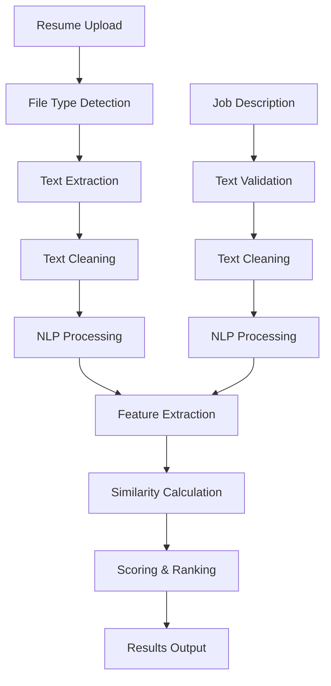

Flow of the model as well as the architecture

# 🤖 AI Resume Screener - Complete Model Flow and Architecture

The AI Resume Screener is a sophisticated system that uses Natural Language Processing (NLP) and Machine Learning to analyze resumes against job descriptions. Here's a comprehensive breakdown of how the entire system works:

## 🔄 Complete System Flow Overview

### 1. Data Input Phase
The system accepts two primary inputs:
- **Resume Files**: PDF, DOC, or DOCX format
- **Job Description**: Text-based job requirements

### 2. Text Extraction and Preprocessing
- **File Processing**: Converts uploaded files to plain text
- **Text Cleaning**: Removes formatting, special characters, and normalizes text
- **Language Detection**: Ensures content is in supported language (English)

### 3. NLP Analysis Engine
- **Tokenization**: Breaks text into meaningful units
- **Named Entity Recognition**: Identifies people, organizations, locations
- **Part-of-Speech Tagging**: Categorizes words by grammatical function
- **Dependency Parsing**: Understands sentence structure and relationships

### 4. Feature Extraction
- **Skills Identification**: Extracts technical and soft skills
- **Experience Analysis**: Determines years of experience and job roles
- **Education Parsing**: Identifies degrees, institutions, and qualifications
- **Keyword Extraction**: Finds relevant industry terms and technologies

### 5. Similarity Calculation
- **Vector Representation**: Converts text to numerical vectors
- **Cosine Similarity**: Measures angle between resume and job vectors
- **TF-IDF Analysis**: Weighs term frequency and importance
- **Semantic Matching**: Uses word embeddings for contextual understanding

### 6. Scoring and Ranking
- **Weighted Scoring**: Combines multiple similarity metrics
- **Threshold Application**: Applies minimum score requirements
- **Ranking Algorithm**: Orders candidates by relevance
- **Confidence Scoring**: Provides reliability metrics

## 🧠 Detailed Technical Architecture

### **Core NLP Pipeline**

#### **Stage 1: Text Preprocessing**
```
Raw Input → Text Extraction → Cleaning → Normalization → Tokenization
```

**Process Details:**
- **Text Extraction**: Uses PyMuPDF for PDFs, python-docx for Word documents
- **Cleaning**: Removes HTML tags, special characters, excessive whitespace
- **Normalization**: Converts to lowercase, handles encoding issues
- **Tokenization**: Splits text into sentences and words using spaCy

#### **Stage 2: Feature Engineering**
```
Tokens → Named Entities → Skills → Experience → Education → Keywords
```

**Feature Categories:**
- **Technical Skills**: Programming languages, frameworks, tools
- **Soft Skills**: Communication, leadership, teamwork
- **Experience Metrics**: Years of experience, job titles, companies
- **Education Data**: Degrees, institutions, graduation years
- **Certifications**: Professional certifications and licenses

#### **Stage 3: Similarity Computation**
```
Resume Features + Job Features → Vector Space → Similarity Score
```

**Similarity Algorithms:**
1. **TF-IDF Vectorization**
   - Term Frequency: How often terms appear in document
   - Inverse Document Frequency: Rarity of terms across corpus
   - Vector Creation: Numerical representation of text

2. **Cosine Similarity**
   - Formula: `cos(θ) = (A·B) / (||A|| × ||B||)`
   - Range: 0 to 1 (0 = no similarity, 1 = identical)
   - Measures angle between vectors, not magnitude

3. **Semantic Similarity**
   - Word embeddings from spaCy's language model
   - Contextual understanding of synonyms and related terms
   - Handles variations in terminology

## 📊 Data Flow Architecture

### **Input Processing Flow**



### **Feature Extraction Pipeline**

#### **Skills Extraction Process**
1. **Pattern Matching**: Regex patterns for common skill formats
2. **Dictionary Lookup**: Predefined skill databases
3. **Context Analysis**: Understanding skill mentions in context
4. **Categorization**: Grouping skills by type (technical, soft, domain-specific)

#### **Experience Analysis**
1. **Date Recognition**: Identifies employment periods
2. **Role Extraction**: Finds job titles and responsibilities
3. **Duration Calculation**: Computes total years of experience
4. **Level Assessment**: Determines seniority level

#### **Education Parsing**
1. **Degree Identification**: Recognizes degree types and levels
2. **Institution Extraction**: Finds university/college names
3. **Field Recognition**: Identifies areas of study
4. **Timeline Analysis**: Determines graduation dates

## 🔢 Similarity Calculation Deep Dive

### **Multi-Dimensional Scoring System**

#### 1. Skills Similarity (Weight: 40%)
- **Exact Matches**: Direct skill overlaps
- **Semantic Matches**: Related skills and synonyms
- **Skill Level**: Experience level with specific technologies
- **Skill Relevance**: Importance of skills to job requirements

#### 2. Experience Similarity (Weight: 30%)
- **Years Match**: Alignment with required experience
- **Role Relevance**: Similarity of previous roles to target position
- **Industry Experience**: Relevant sector experience
- **Career Progression**: Growth trajectory analysis

#### 3. Education Similarity (Weight: 20%)
- **Degree Level**: Bachelor's, Master's, PhD alignment
- **Field Relevance**: Study area match to job requirements
- **Institution Prestige**: Quality of educational background
- **Certification Match**: Professional certifications

#### 4. Contextual Similarity (Weight: 10%)
- **Keyword Density**: Frequency of relevant terms
- **Language Style**: Professional communication level
- **Achievement Indicators**: Quantifiable accomplishments
- **Cultural Fit**: Soft skills and values alignment

### **Scoring Formula**
```
Final Score = (Skills_Score × 0.4) + 
              (Experience_Score × 0.3) + 
              (Education_Score × 0.2) + 
              (Context_Score × 0.1)
```

## 🎯 Machine Learning Components

### **Model Architecture**

#### 1. Text Vectorization
- **TF-IDF Vectorizer**: Converts text to numerical features
- **Feature Selection**: Selects most relevant terms
- **Dimensionality Reduction**: Reduces vector space complexity
- **Normalization**: Standardizes feature scales

#### 2. Similarity Models
- **Cosine Similarity**: Primary similarity metric
- **Jaccard Similarity**: Set-based similarity for skills
- **Levenshtein Distance**: String similarity for names/titles
- **Semantic Similarity**: Word2Vec/GloVe embeddings

#### 3. Ranking Algorithm
- **Score Aggregation**: Combines multiple similarity metrics
- **Threshold Filtering**: Applies minimum score requirements
- **Ranking Function**: Orders candidates by composite score
- **Confidence Calculation**: Provides reliability metrics

### **Training and Optimization**

#### **Model Training Process**
1. **Data Collection**: Gather resume-job pairs with relevance scores
2. **Feature Engineering**: Extract and transform text features
3. **Model Training**: Train similarity models on labeled data
4. **Validation**: Test model performance on holdout data
5. **Hyperparameter Tuning**: Optimize model parameters

#### **Continuous Learning**
- **Feedback Loop**: Incorporates user feedback on results
- **Model Updates**: Regularly retrain with new data
- **Performance Monitoring**: Tracks accuracy and relevance
- **A/B Testing**: Compares different model versions

## 📈 Performance Metrics and Evaluation

### **Accuracy Metrics**
- **Precision**: Percentage of relevant results in top matches
- **Recall**: Percentage of relevant candidates found
- **F1-Score**: Harmonic mean of precision and recall
- **Mean Average Precision**: Average precision across queries

### **User Experience Metrics**
- **Response Time**: Speed of similarity calculation
- **Relevance Score**: User satisfaction with results
- **Coverage**: Percentage of skills/experience captured
- **Consistency**: Reproducibility of results

### **System Performance**
- **Throughput**: Number of resumes processed per second
- **Scalability**: Performance under increasing load
- **Resource Usage**: CPU, memory, and storage efficiency
- **Error Rate**: Frequency of processing failures

## 🔧 Technical Implementation Details

### **Technology Stack**
- **Backend**: FastAPI (Python)
- **NLP Engine**: spaCy with English language model
- **ML Library**: scikit-learn for similarity calculations
- **Text Processing**: PyMuPDF, python-docx for file parsing
- **Vector Operations**: NumPy for numerical computations
- **Database**: PostgreSQL for data storage (optional)

### **API Endpoints and Data Flow**
1. **`/api/upload-resume`**: File upload and text extraction
2. **`/api/extract-skills`**: Skills identification and categorization
3. **`/api/score-resume`**: Similarity calculation and scoring
4. **`/api/analyze-job-description`**: Job requirements analysis
5. **`/api/batch-score`**: Multiple resume processing

### **Data Storage and Caching**
- **File Storage**: Temporary storage for uploaded files
- **Text Cache**: Processed text for faster re-analysis
- **Model Cache**: Pre-loaded ML models for quick access
- **Results Cache**: Cached similarity scores for repeated queries

## 🚀 Real-World Application Flow

### **Typical User Journey**
1. **Job Posting**: HR uploads job description
2. **Resume Collection**: Candidates submit resumes
3. **Batch Processing**: System analyzes all resumes
4. **Ranking**: Candidates ranked by relevance score
5. **Review**: HR reviews top-ranked candidates
6. **Feedback**: System learns from hiring decisions

### **Use Cases**
- **Initial Screening**: Filter large applicant pools
- **Candidate Ranking**: Order applicants by fit
- **Skills Gap Analysis**: Identify missing qualifications
- **Job Matching**: Match candidates to multiple positions
- **Talent Pipeline**: Build candidate databases

This comprehensive system combines advanced NLP techniques with machine learning algorithms to provide accurate, fast, and scalable resume screening capabilities, significantly improving the efficiency of the hiring process while maintaining high accuracy in candidate selection.

[1] https://pplx-res.cloudinary.com/image/private/user_uploads/70837782/edcbc6b5-96d6-4584-9b26-c151fdb373fa/Screenshot-2025-07-09-202210.jpg
[2] https://pplx-res.cloudinary.com/image/private/user_uploads/70837782/d9667395-f921-4886-af20-7f41e1d05f2a/Screenshot-2025-07-09-202203.jpg